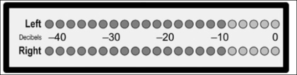
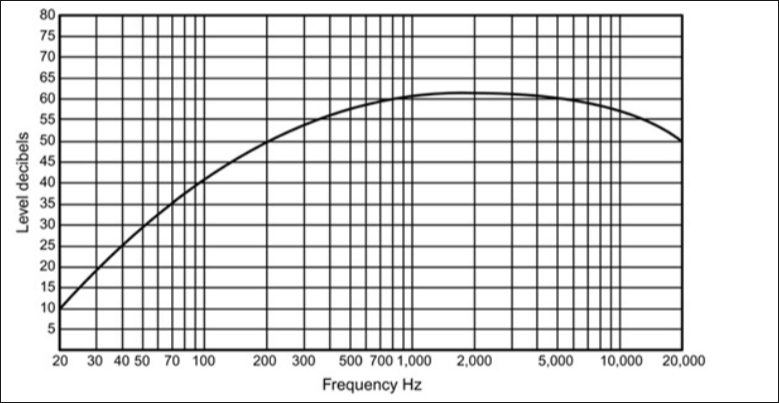
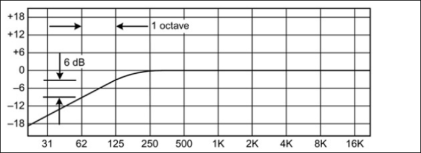
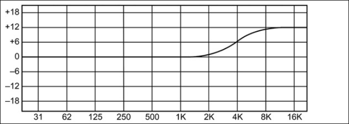
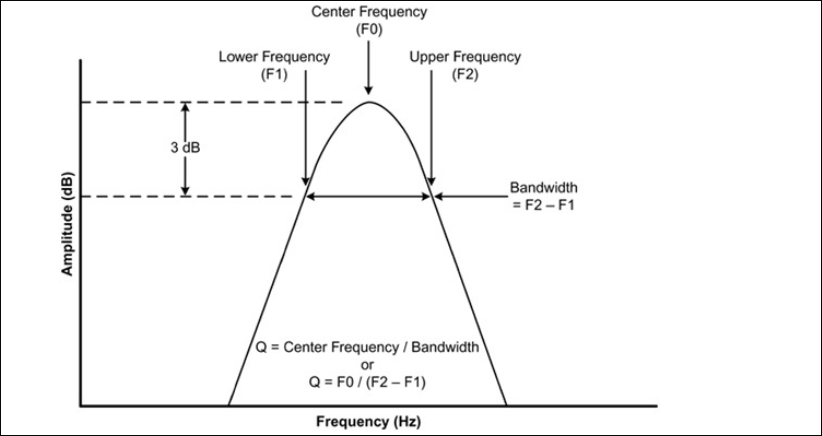
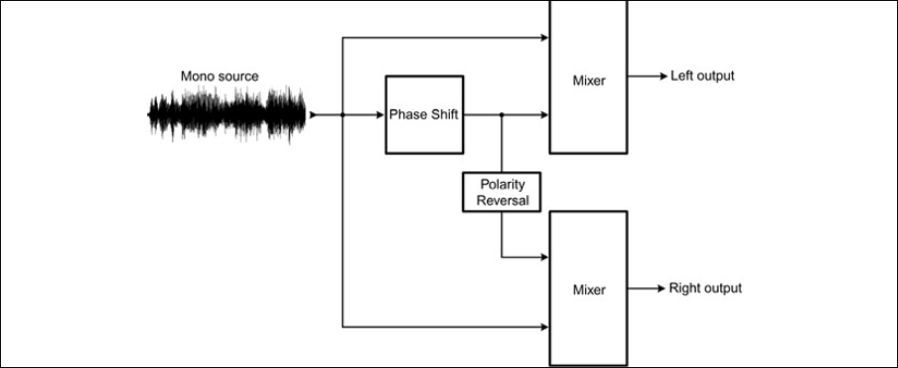

# Audio Basics
Parliamo di cose oggettive, numeri!

## Volume e decibels

Il volume di una canzone (un suono) o sound pressure level (SPL) si misura in `decibel`.
Si misura quindi un cambiamento della pressione dell'aria che si propaga fino ai timpani, facendoli vibrare.

Per definizione il decibel esprime un `rapporto` tra due SPL ma in pratica puo' anche rappresentare un volume assoluto. In questo caso esiste una reference implicita a 0dB (il suono piu' piano che il nostro orecchio puo' sentire (threshold of hearing)).

> [!NOTE] Lo sapevi?
> 0dB SPL sono circa 20 micropascals (pressione dell'aria)
>

Sono in scala `logaritmica`:
* +6 dB = il doppio di pressione dell'aria o di volts
* +20 dB = 10 volte la pressione dell'aria o di volts
* +40 dB = 100 volte la pressione dell'aria o di volts
* +60 dB = 1_000 volte la pressione dell'aria o di volts
* +80 dB = 10_000 volte la pressione dell'aria o di volts
* -6 dB = la metà di pressione dell'aria o di volts

Quindi se il voltaggio di una sorgente acustica aumenta di 10 volte, il suono emesso da quella sorgente aumenta di 20dB

A noi per sembrarci di avere raddoppiato il volume di una canzone ci bastano 8-10dB (a seconda delle frequenze presenti nella canzone).
Infatti siamo più sensibili ai cambiamenti di volume tra le frequenze medie, invece poco negli alti/bassi.
Anche la stanza in cui si ascolta influenza il modo in cui sentiamo un cambiamento di volume: in una stanza non trattata con molti echo sarà sicuramente più difficile sentire una differenza di mezzo decibel.

## Livelli Standard di Segnale (p33)

Anche nei componenti elettronici che trasportano segnali audio si usano i decibel.
Un amplificatore che raddoppia il segnale in output si dice che ha un gain di 6dB (nota che non importa il valore di volt che ha in ingresso).

Scegliendo delle reference diverse (diverse da 0dB (soglia dell'udibile)) posso ricavare altre unità di misura.
Tra i dispositivi audio professionali si usa il `dBu` per dire i voltaggi di input e output che supportano. 0 dBu corrispondono a 0.775 volts (reference).

In questo modo se ho un numero di dBu posso direttamente convertire in volt (normalmente non potrei farlo perchè il dB non è un valore assoluto)

20 dBu sono 10 volte 0 dBu (quindi 7.75 volts).

Obsoleto, si usava anche il `dBm` che fissa a 0dBm 1 milliwatt.

Poi c'è il `dBV` in cui 0 dBV corrispondono a 1 volt. L'offset di 0.225 volt tra dBV e dBu da si che lo stesso numero in dBV e dBu abbia una differenza di 2.21 dB.

Per l'audio digitale si ha il `dBFS` dove FS sta per Full Scale. 0 dBFD è il piu' grande numero digitale che una sound card o analog digital converter può accettare in input/dare in output (infatti si misurano con i numeri negativi).

Poi c'è la differenza tra il livello di picco e il medio in un segnale digitale (pensa al segnale elettrico che passa nel cavo delle cuffie o in quello di un diffusore, li' la corrente e' alternata, la ddf cambia continuamente tra diversi voltaggi, è il voltaggio che cambia che fa muovere la membrana che poi sposta l'aria).
Questo si chiama livello `RMS`. Diciamo che misura matematicamente l'energia media del segnale.
* Quando si registra l'audio ci interessa molto il voltaggio di picco (peak level) perché è quello che poi determina se l'audio avrà distorsioni.
* Invece la _loudness_ percepita è determinata dal voltaggio medio (anche questa ci importa).
* Il valore di RMS invece serve più agli ingegneri elettrici che a noi audiofili.

Per calcolare la loudness e i livelli di picco prendi tutti i valori assoluti ovviamente (perchè i volt che passano nei fili delle cuffie possono anche essere negativi (fanno muovere la membrana dall'altra parte))

## Livelli di segnale e Metering

Gli strumenti di misurazione dei livelli audio sono importantissimi per la registrazione e il mixing perchè ogni recording medium (analog tape, ...) ha un range di livelli di volume che puo' supportare.
Infatti se registrando in analog tape l'audio è registrato troppo piano poi senti un hiss quando lo senti, invece se lo registri troppo forte viene distorto.
Uno dei primi strumenti di misurazione volume audio era il `VU meter` (VU = volume units).
I moderni strumenti digitali invece usano un scala con LED come questa (anche quelli dei DAW):

Questi strumenti digitali possono anche avere uno switch per mostrarti i valori di picco oppure medi.
Questo è un concetto importante (il fatto che possano mostrare anche i valori medi) perchè le nostre orecchie riconoscono l'average loudness di un suono, e non molto i valori di picco. I valori di picco sono comunque importantissimi perchè sono quelli che vengono distorti dalle sound card dei computer e analog tape quando raggiungono il cosiddetto `clipping point`.

I VU meters invece per loro natura mostrano i livelli di voltaggio medi e quindi il volume medio. Infatti la lancetta impiega del tempo a muoversi e stabilizzarsi, non riesce a star dietro ai rapidi cambiamenti dei voltaggi della musica e del parlato quindi tende ad aggirarsi nei volumi medi.
Sono ottimi quando una canzone ha dei volumi che cambiano costantemente perchè rappresentano meglio quello che sentono le nostre orecchie.
Ma non ti dicono i valori precisi di picco (se non aggiungi altri strumenti di supporto).

Gli strumenti digitali ti possono anche mostrare contemporaneamente i valori di picco e average e poi possono anche mostrarti il valore di picco piu' alto raggiunto. Così se mentre registri non te ne sei accorto lo vedi dopo il picco più alto raggiunto.

La differenza tra il livello di picco di un segnale e il suo livello medio è detto `crest factor`. Ti dice quanto estremi sono i picchi. Un crest factor di 1 vuol dire che non ci sono picchi.

> [!WARNING]
> non confondere crest factor e dynamic range.
> Il crest factor è il rapporto tra i picchi e i livelli medi (per i valori medi si prende l'RMS).
> Il dynamic range è la differenza tra i picchi e i livelli minimi.
>

Il concetto dei valori di picco e medi si applica anche agli amplificatori. Infatti alcuni amplificatori possono mostrare un output anche il doppio del massimo rated per piccoli periodi di tempo proprio per fare suonare i picchi.
Infatti un altro dato per gli amplificatori è il peak power output che e' molto più alto dei valori di potenza media che possono dare e prima del 1974 (quando è uscita una legge) i produttori pubblicizzavano soprattutto i valori di picco scammando la gente.

## Calcolare i decibel

Ricorda che con solo dei voltaggi non puoi sapere il volume SPL (per quello ti serve la resistenza che poi usi per calcolare la potenza e quindi il volume) ma con una differenza di voltaggi puoi ricavare l'aumento (diminuzione) dei decibel:
ad esempio se aumento 2 volte il voltaggio so che avrò sicuramente un aumento di 6dB SPL del suono (non ho bisogno di conoscere la resistenza per dirlo).

Le formule precise sono queste:

$ dB\ tra\ voltaggi = 20 * log_{10}(\frac{V_{2}}{V_1}) $

## Frequenze

Si misurano in Hertz (`Hz`).
Ogni nota ha la sua frequenza. Raddioppiando la frequenza la nota passa all'ottava superiore. Essendoci 12 note in un ottava, per ottenere la frequenza della nota successiva di una nota devo moltiplicare per $\sqrt[12]{2}$

> [!NOTE]
> overtones = harmonics = partials

### Graphing Audio

Il volume (dB) è espresso linearmente e le frequenze sono espresse in modo logaritmico, infatti il grafico è un `semi-log`.
Però, dato che in realtà i dB sono intrinsecamente logaritmici, se fossero espressi in volts allora sarebbero da esprimere logaritmicamente e quindi avrei un grafico log-log.

In questo grafico, la distanza tra 20 e 40 Hz è la stessa che c'è tra 200 e 400 Hz infatti in entrambi gli intervalli ci sono 12 note.
La stessa cosa tra 20 Hz - 200 Hz e 200 Hz - 2000Hz (ho moltiplicato x10 in entrambi i casi e quindi cii sono le stesse note).

## Filtri

Un filtro audio è un dispositivo che selettivamente passa o sopprime un range di frequenze.
Un filtro molto amato dagli audiofili è l'equalizzatore (anche se in generale sono più complessi dei filtri basic di cui sono composti).
Ci sono 5 tipi base di filtri. Apparte la frequenza di cutoff i filtri high-pass e low-pass hanno anche la proprietà di decadimento del suono chiamata `slope`, specificata in dB per ottava.
Il `cutoff` è la frequenza in cui la response scende di 3 dB.

* [High-Pass] - fa passare le frequenze sopra al cutoff;
* [Low-Pass] - fa passare le frequenze sotto al cutoff;
* [Band-Pass] - fa passare le frequenze attorno la freq centro scelta;
* [Band-Stop] - fa passare tutte le frequenze apparte un range attorno la freq scelta.

In questo caso la frequenza di cutoff dell'high-pass è a 125 Hz. La slope è 6 dB per ottava.

La maggior parte dei filtri non taglia completamente le frequenze che non fa passare. Hanno un limite sul massimo boost o taglio di frequenze (non puoi mandare delle frequenze a 0 dB).
Quando tagli o boosti il range di frequenze sopra o sotto la frequenza di cutoff si dice `shelving` perchè in effetti fanno quella forma lì i filtri.
I filtri shelf non continuano ad "andare giù" dopo il cutoff:

Un altro parametro importante dei filtri è il parametro `Q` (_quality_).
L'interpretazione di Q varia da filtro a filtro. Di solito sono riferiti a filtri Band-Pass. In questo caso se Q è minore di 1 (e maggiore di 0) la campana è molto schiacciata (il filtro si sente molto di più perché coinvolge molte più frequenze), invece se Q è maggiore di 1 la campana diventa molto appuntita.

AKSHUALLY Q viene da un calcolo abbastanza semplice spiegato nell'immagine sotto.

> Applying a high Q to a low-pass filter is the basis for analog synthesizer
> filters, as made famous by early Moog models. For example, the low-pass filter in
> a MiniMoog has a slope of 24 dB per octave; the sharp slope coupled with a
> resonant peak at the cutoff frequency creates its characteristic sound.

## Phase Shift and Time Delay

AKSHUALLY esiste anche un altro tipo di filtro: il all-pass filter... ma che senso ha?
Beh ecco, serve ad applicare dello sfasamento di fase (`phase shift`) (non cambia freq).
E cos'è ti chiedi? Dai è quell'effetto tipo chorus (?). Può anche essere usato per creare un suono stereo artificiale. È simile al `flanger` effect (usa del time delay invece che phase shift (che mi sembra essere praticamente la stessa cosa*)).

*AKSHUALLY non sono la stessa cosa: il time delay shifta tutte le frequenze allo stesso modo, il phase shift invece delaya alcune frequenze più di altre.

La frequenza di centro di un all-pass filter e' definita come la frequenza in cui il phase shift e' di 90 gradi (infatti schifta ogni frequenza di una quantita' di gradi diversa), ossia i picchi di quella frequenza corrispondono a quando quella stessa frequenza a 0 se non fosse stata shiftata.

Quando combini un audio con la sua versione passata ad un all-pass filter cambia la frequency response. Infatti a seconda delle frequenze le onde possono sommarsi oppure cancellarsi (parzialmente o totalmente).

> [!NOTE]
> BTW questo e' il principio di base di funzionamento degli equalizzatori analogici

Un all-pass filter può anche essere usato per creare un effetto pseudo-stereo, funziona così:
prendi il segnale audio _x_, e passalo prendendo un all-pass filter e ottieni _y_.
Nel canale destro mettici _x-y_, nel sinistro mettici _x+y_.
Nelle frequenze in cui le frequenze shiftate annullano le normali x si ha che il canale sinistro (_x+y_) suona più piano mentre il destro invece più forte.
Fai finta che a 200Hz si annullerebbero le normali, a 500Hz invece si sommano le normali, a 1kHz si annullano di nuovo, ... ottengo che

|  | Left | Right |
| --------------- | --------------- | --------------- |
| 200Hz | forte | debole |
| 500Hz | debole | forte |
| 1kHz | forte | debole |
| 2kHz | debole | forte |
| 5kHz | forte | debole |

E così freghi il tuo cervello a pensare che tipo la chitarra è a destra e la voce a sinistra.
In ogni canale si crea un cosiddetto `comb filter` (somma (sottrazione) del segnale originale con quello shiftato) perchè il grafico delle frequenze sembra un pettine (dove sono contrarie si annullano altrimenti si sommano)

 Polarity reversal = invertire il voltaggio

Un'altra piccola figatina per fare un effetto fakestereo è prendere il segnale audio _x_, creare due audio shiftati (diversamente) _y_ e _z_ e mettere _y_ nel canale sinistro e _z_ nel destro.
In questo caso non si altera la frequency response e si crea tantissima width e dimensione.
Tra l'altro se la quantità di phase shift viene modulata nel tempo si produce un suono simile a un `Leslie rotating speaker` (quello dell'organo hammond per intenderci).
BTW il Leslie speaker usa l'effetto Doppler! Che alla fine è proprio quello che vai a ricreare facendo phase shift.

Anche i primi eq digitali sfruttavano una specie di phasing. Vedi paragrafo p.54 se ti interessa.

