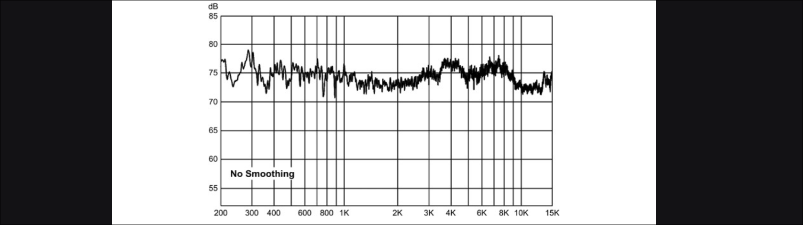

# Iniziamo il secondo capitolo

Pagina wikipedia utile:
`https://en.wikipedia.org/wiki/Audio_system_measurements`

## Hi-Fi

Per definizione "high fidelty" (`Hi-Fi`) significa riprodurre un suono il più simile possibile al vero (quindi c'è una copia e una sorgente del suono).
Eppure, alcune forme di degradazione dell'audio possono suonare piacevoli (ecco perchè la popolarità dei registratori a nastro, i dispositivi con i 'tubes' e transformers, e vinili).
Devi essere tu a decidere se ti piacciono o meno, se sono voluti allora perfetto.

Fa vedere una review dove un 'critico' di un magazine di hifi confronta dei preamp parlando con termini completamente soggettivi...

Bastano 4 parametri per definire _tutto_ che coinvolge l'audio equipment: `noise`, `frequency response`, `distorsion` ed errori basati sul tempo (`time based errors`).
Sono più che altro categorie di parametri.

## I 4 Parametri

### Noise

È l'hiss di sottofondo (suono "ssssss") che senti quando alzi il volume in un amp, o un receiver (dispositivo che fa da hub tra input e output diversi).
Si può sentire di solito quando ascolti delle cassette coi nastri nei passaggi molto silenziosi.

Un cugino vicino è il `dynamic range`. È la differenza in dB tra l'hiss di sottofondo residuo e i volumi più alti raggiungibili senza distorsione.
I CD e i DVD hanno un grandissimo dynamic range, quindi se quando ne ascolti uno senti dell'hiss significa che viene dal nastro master originale della registrazione (per registrazioni vecchie immagino). Potrebbe essere stato aggiunto durante la produzione o era nella stanza di registrazione e i microfoni l'hanno catturato.

Dei sottoinsiemi del noise sono gli hummm e i buzzz dati dalla corrente alternata, i click e i pops dei vinili, _electronic crackling_, _left-right channel bleed-throug (cross-talk)_, porte e finestre che vibrano quando si ascolta ad alto volume, e l'effetto triboelettrico dei cavi (succede quando maneggi cavi rovinati o di pessima qualità (oggi è molto raro)).

### Frequency response

Descrive quanto uniformemente un dispositivo audio risponde a varie frequenze.
Gli errori si sentono quando senti troppi bassi / medi (midrange) / alti (treble).
Per la stragrande maggioranza delle persone si sente tra i 20Hz e i 20kHz, alcuni giovini anche oltre, i vecchi spesso anche meno di 10kHz.
Qualche cialtrone "audiofilo" pensa che sia importante che i dispositivi supportino anche audio oltre i 20kHz ma son cazzate.

Sottoinsiemi del frequency response sono _physical microphonics_ (risonanza meccanica), ringing e oscillazioni elettroniche e la risonanza acustica.

### Distorsione

È un modo più semplice per dire `nonlinearità`. Aggiunge nuove frequenze che non erano presenti nella sorgente originale.
Negli amplificatori ciò succede quando il circuito amplifica alcuni voltaggi più o meno di altri.

Questa nonlinearità può appiattire i picchi delle onde (è una compressione che avviene quando metti al massimo volume l'amp e quindi i driver), oppure può shiftare un po' nello 'zero' dove i voltaggi passano dal positivo al negativo (`crossover distorsion`).

Alcuni circuiti comprimono i picchi superiori più dei picchi inferiori (o vice versa), in questo caso la distorsione non è simmetrica e si formano armoniche pari e dispari (seconda, terza, quarta, quinta e così via).
Altri invece comprimono i picchi allo stesso modo (simmetricamente). Si aggiungono armoniche dispari: terza, quinta, settima e così via.

Invece la crossover distorsion avviene solo per alcuni tipi di amplificatori (ricorda quel video di headphones.com).

Come abbiamo già detto un po' di distorsione è inevitabile, si può mitigare progettando dispositivi con distorsione così bassa da essere inudibile.
C'è pure gente a cui piacciono particolari tipi di distorsione.
La preferenza di Ethan è di avere dispositivi il più _trasparenti_ possibile.

I due tipi di distorsione di base sono la distorsione `armonica` e `intermodulare`, entrambe sono sempre presenti insieme.

La distorsione armonica aggiunge nuove frequenze che sono relative alla sorgente (possono anche suonare abbastanza bene).
Ignorando gli _overtones_ che sono già presenti di base, se prendiamo un La di un basso acustico con fondamentale a 110Hz, la distorsione armonica aggiunge nuove frequenze a 220Hz, 330Hz, 440Hz e così via.
Alcuni dispositivi come già detto aggiungono più armoniche pari che dispari.
La distorsione armonica aggiunge una "thick" o "buzzy" qualità alla musica.
Gli strumenti musicali hanno già armoniche proprie, quindi un dispositivo che aggiunge armoniche per distorsione cambia il timbro dello strumento di una qualche quantità.
I chitarristi elettrici usano la distorsione armonica (anche tantissima) per creare un suono potente e sostenuto.

La distorsione intermodulare (IMD) si verifica quando 2 o più frequenze sono presenti.
È molto meno voluta questa perchè aggiunge frequenze che non c'entrano un fico secco con quelle originali.
Ne avevamo già parlato, aggiunge frequenze relative alle somme e differenze delle originali.
Anche in piccole quantità l'IMD aggiunge una qualità dissonante che può essere anche parecchio spiacevole alle orecchie.
In più, quando l'IMD è presente in suoni di strumenti musicali, dove le armoniche ci sono già, anche queste partecipano all'IMD...

Un altro tipo di distorsione è l'`aliasing` che è unico all'audio digitale.
Funziona come l'IMD, infatti è molto irritante. Fortunatamente con i dispositivi digitali moderni è assolutamente impercettibile.

Poi c'è la `Transient intermodulation distorsion` (TDM) che avviene solo nei `transienti` (suoni che aumentano velocemente di volume, come snares, piatti, e altre percussioni).
Questo tipo di distorsione non si rileva con un test standard di un seno a 1kHz ma si vede facilmente attraverso un'oscilloscopio connesso all'output del dispositivo da testare quando si usa un segnale test con pulse waves.
È anche rilevabile con il Null Test (passando suoni con transienti).
Negli Amp moderni di solito non si sente per niente.

### Time Based Errors (errori basati sul tempo)

Sono quelli che modificano il pitch e il tempo.
Quando suoni un vinile che non è perfettamente centrato, si sente il pitch che ad ogni rivoluzione si alza e si abbassa. Questo è il `wow`.
L'instabilità del pitch di un analog tape recorder invece è detto `flutter`. Questo aggiunge un "warbling effect".
I registratori digitali hanno il `jitter`, ma le modifiche ai pitch sono così istantanee che diventano rumore (noise) aggiunto. Nei dispositivi moderni è impercettibile.
Poi c'è il `phase shift` ma anche questo è inudibile (a parte se non è presente in quantità diverse tra i canali destro e sinistro, in tal caso è terribile (aggiunge un sacco di stereo)).

---

Anche l'acustica di una stanza potrebbe essere considerato un parametro audio, ma non lo è veramente.
Aggiungono echo, riverbero e risonanza e anche effetto pettine se non trattate.
Nel contesto dell'acustica, la risonanza è spesso chiamata 'modal ringing' nelle frequenze basse, 'flutter echo' nei medi e alti.

Un altro aspetto della qualità dei dispositivi è il `channel imbalance` in cui i canali destro e sinistro vengono amplificati in quantità diverse (che merd).
È un difetto di manifattura più che un difetto audio. Non è considerato un parametro perchè non influisce sulla qualità in se.

Con i 4 parametri di prima hai TUTTO quello che ti serve per conoscere la _fedeltà_ di un dispositivo audio.
Se il dispositivo ha noise e distorsione troppo leggere per sentirsi, con una frequency response sufficientemente uniforme e errori di tempo troppo piccoli da notare allora quel dispositivo è `acusticamente trasparente` all'audio che ci passa attraverso.
L'importante è che non si sentano all'orecchio, anche se con un Null Test si rileva qualcosa.

Anche la risonanza non è proprio un parametro audio ma una proprietà.

Senza dubbio comunque la stanza in cui ascolti influenza la qualità del suono più che un qualsiasi dispositivo elettronico audio.
Comunque, il punto è che con questi 4 parametri puoi constatare la qualità di amplificatori, preamplificatori, sound cards, diffusori, microfoni e tanto altro.

## Le Bufale Audio

Bastano quei 4 parametri, il resto è marketing...
A volte i produttori poco seri fanno vedere i grafici della frequency response con lo `smoothing` (o `averaging`).
In questo modo smussano il grafico facendone perdere i dettagli (spesso molto importanti).

Un altro trick che usano è usare una scala molto grande sulle y così le variazioni di volume sembrano minime... dai non ci puoi cascare.

## Strumentazione di Testing

Per le misurazioni del noise si fa abbastanza facilmente con un `voltimetro`.
Il voltmetro pero' deve avere una risposta di frequenza piatta su tutto il range acustico (molti modelli budget non sono accurati sopra i 5/10kHz).
Per fare questa misurazione, un amplificatore (o altri dispositivi) vengono accesi ma senza un segnale di input e viene misurato il voltaggio residuo all'output.
Di solito vengono connessi un resistore o un corto circuito in input per simulare una sorgente audio. Senza, potrebbe entrare hiss o hum in input e venire amplificati ingiustamente.
Negli amplificatori con il controllo del volume devi anche segnarti a che livello era quando hai fatto il test.

Per quanto possa essere semplice misurare la quantità di noise introdotta da un dispositivo audio, quello che viene misurato non significa che venga sentito così.
Infatti le nostre orecchie sono meno sensibili alle frequenze basse e alte rispetto alle medie, e sono specialmente sensibili alle frequenze tra i 2 e i 3 kHz.
Quindi noise a quelle frequenze è molto più grave di quello ad alte frequenze o basse. Per questo motivo alle misurazioni si applica anche il `weighting`!
Così le frequenze medie hanno più importanza rispetto alle altre. La curva di weighting è la `A-weighting curve` che corrisponde alle frequenze che sentiamo quando si ascolta a medio - basso volume (a volume alto sentiamo tutte le frequenze in egual modo).

Per misurare la distorsione, invece, in passato si usava un analizzatore dedicato.
Questo mandava una sine wave ad una singola frequenza con armoniche e noise minimo.
Dopodiché veniva applicato un notch filter per rimuovere il seno fondamentale.
Infine viene applicato un voltimetro all'output e quello che rileva e' distorsione (e noise).

L'IMD invece viene misurata allo stesso modo solo introducendo 2 seni invece che uno solo.
Ci sono 2 metodi standard che differiscono per le frequenze dei 2 seni:
* metodo 1: mandi in input 60Hz e 7khz con i 60Hz 4 volte più rumorosi dei 7kHz;
* metodo 2: 19kHz e 20kHz allo stesso volume.

Analizzatori audio moderni (costano un sacco, l'Audio Precision APx525 era a 13k su ebay) sono molto sofisticati e possono misurare molto più che freq response, noise, e distorione.
Sono anche immuni al `masking` ossia l'effetto per cui se ci sono suoni ad alto volume e altri molto alti, gli alti mascherano completamente i bassi e non li senti per niente.
Questi dispositivi possono fare misurazioni precisissime ma anche con un semplice computer si può fare moltissimo.
Per esempio se voglio misurare la distorsione di una sound card un po' cheap posso creare un seno puro su un DAW e poi metterlo in output su una sound card che so essere di ottima qualità con bassa distorsione.
Poi mandi il segnale alla sound card cheap e lo registri in output. Esegui poi una FFT dal computer e hai fatto!

Di solito la distorsione negli amplificatori (e tutti i dispositivi che contengono trasformatori) aumenta quando si aumenta il volume.
È più facile avere poca distorsione 1kHz rispetto che 30Hz, infatti le frequenze più basse sono quelle 

> [!NOTE] Presa in più da wikipedia
> THD sta per `total harmonic distorsion` ed è il rapporto degli RMS sommati di tutte le frequenze armoniche introdotte dalla distorsione fratto l'RMS della fondamentale.
> Ad oggi accade spesso che distorsione armonica, noise e hum vengano tutti aggiunti alla THD (THD+N (Noise)).
> Quindi per esempio se un amplificatore aggiunge l'1% di distorsione

> [!NOTE]
> La distorsione sopra a fondamentali di 10kHz è irrilevante perchè le armoniche sono sopra a 20kHz.

Molti produttori pubblicano specifiche con THD misurata a 1kHz, spesso a volumi molto sotto l'output massimo... BASTARDI FURBONI.
